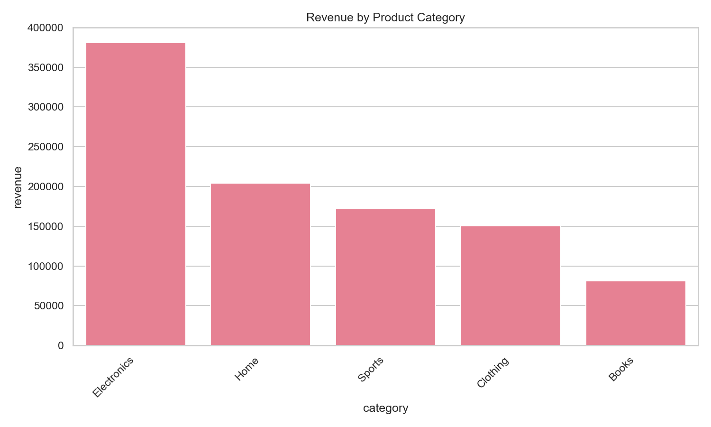

# AI Data Analyst

Private analytics project for turning plain-language business questions into SQL, statistical summaries, experiment analysis, charts, and written reports.

The repository includes a database-backed analysis pipeline, offline demos, statistical experiment analysis, local evals, Hugging Face text-to-SQL benchmark sampling, and an MCP server for exposing safe project tools.

## What It Does

- Inspects a PostgreSQL schema and builds query context.
- Plans an analysis from a business question.
- Generates and safely executes read-only SQL.
- Computes descriptive statistics, correlations, trends, and group summaries.
- Analyzes A/B tests with confidence intervals, bootstrap uncertainty, effect sizes, power, MDE, multiple-testing correction, and statistical audit warnings.
- Produces chart artifacts and markdown reports.
- Runs offline SQL evals for validity, efficiency, similarity, and keyword coverage.
- Streams small Hugging Face text-to-SQL benchmark samples for external evals.
- Exposes MCP tools for SQL scoring, evals, project metadata, and row analysis.

## Demos

The fastest way to review the project is the offline portfolio demo. It requires no API key and no database.

```bash
uvx poetry install
uvx poetry run ai-data-analyst-demo
```

The demo creates deterministic ecommerce data, answers five business questions, generates charts, writes result CSVs, and exports markdown/HTML reports.

Sample output:



More demo artifacts:

- [Portfolio demo report](docs/PORTFOLIO_DEMO.md)
- [Monthly revenue trend](docs/assets/monthly_revenue_trend.png)
- [Discount margin risk](docs/assets/discount_margin_risk.png)

Run the statistics-focused experimentation demo:

```bash
uvx poetry run ai-data-analyst-experiment-demo
```

The experiment demo simulates a pricing/offer test and reports treatment effects with uncertainty, power, MDE, multiple-testing correction, and interpretation warnings.

Experiment demo artifacts:

- [Experimentation demo report](docs/EXPERIMENTATION_DEMO.md)
- [Treatment effect chart](docs/assets/experiment_effects.png)
- [Experimentation notebook](notebooks/experimentation_demo.ipynb)

## Architecture

```text
Question
  -> schema introspection
  -> analysis plan
  -> SQL generation
  -> read-only query execution
  -> statistical analysis
  -> chart generation
  -> markdown report
```

Core modules:

```text
src/agents/          planner, SQL, analyst, visualizer, reporter nodes
src/graph/           LangGraph state and routing
src/tools/           SQL, charting, stats, schema helper tools
src/stats/           experiment analysis, uncertainty, power, audit checks
src/db/              PostgreSQL connection and introspection
src/demo/            offline portfolio demo
src/mcp_server/      MCP tools and resources
evals/               local and Hugging Face-backed eval runners
tests/               unit and integration tests
```

## Evals

Run the local SQL eval baseline:

```bash
uvx poetry run ai-data-analyst-evals --format markdown
```

Run a small streamed BIRD-style Hugging Face benchmark sample:

```bash
uvx poetry run ai-data-analyst-evals \
  --source huggingface \
  --hf-preset bird \
  --limit 25 \
  --format markdown
```

Export a normalized benchmark sample:

```bash
uvx poetry run ai-data-analyst-evals \
  --source huggingface \
  --hf-preset bird \
  --limit 50 \
  --export-dataset output/bird_lite_sample.json
```

Eval metrics include:

- SQL validity
- basic query efficiency
- similarity to expected SQL
- SQL clause coverage
- prediction coverage
- weakest-case summary

## Statistical Experimentation

The `src/stats/experimentation.py` module adds a statistics-heavy layer for controlled experiments:

- Welch mean-difference tests with analytic and bootstrap confidence intervals
- Two-proportion z-tests for conversion-style metrics
- Effect sizes: Cohen's d and Cohen's h
- Power and minimum detectable effect diagnostics
- Benjamini-Hochberg false-discovery-rate correction
- Audit findings for low sample size, low power, uncertain intervals, and practical significance

This is intentionally separate from the SQL/reporting pipeline so it can be tested and reused independently.

## MCP

Start the MCP server:

```bash
uvx poetry run ai-data-analyst-mcp
```

Exposed tools include:

- `project_info`
- `score_sql`
- `list_eval_cases`
- `list_huggingface_eval_presets`
- `run_sql_eval`
- `run_huggingface_sql_eval`
- `evaluate_sql_predictions`
- `evaluate_sql_predictions_report`
- `analyze_rows`

See [docs/MCP.md](docs/MCP.md).

## Tests

Run the full unit suite:

```bash
uvx poetry run pytest tests/unit/ -v
```

Current local verification:

```text
98 unit tests passed
```

## Database Path

The database-backed flow expects PostgreSQL and the seed file:

```text
data/seed/ecommerce_seed.sql
```

The default local database URL is configured in `src/config/settings.py` and can be overridden with `DATABASE_URL`.

## Tech Stack

- Python 3.10+
- LangGraph / LangChain
- PostgreSQL / psycopg3
- pandas, numpy, scipy
- matplotlib, seaborn, plotly
- Streamlit
- Braintrust/autoevals
- Hugging Face Datasets
- MCP Python SDK
- pytest

## Notes

- This repository is private.
- Generated `output/` files, local caches, virtual environments, and local tool config are ignored.
- Selected demo charts and the portfolio demo report are committed under `docs/` for review.
